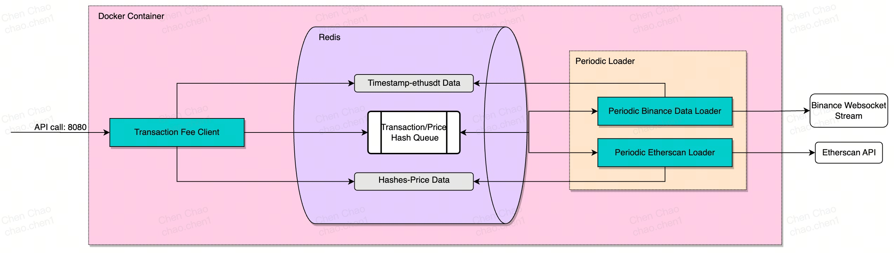
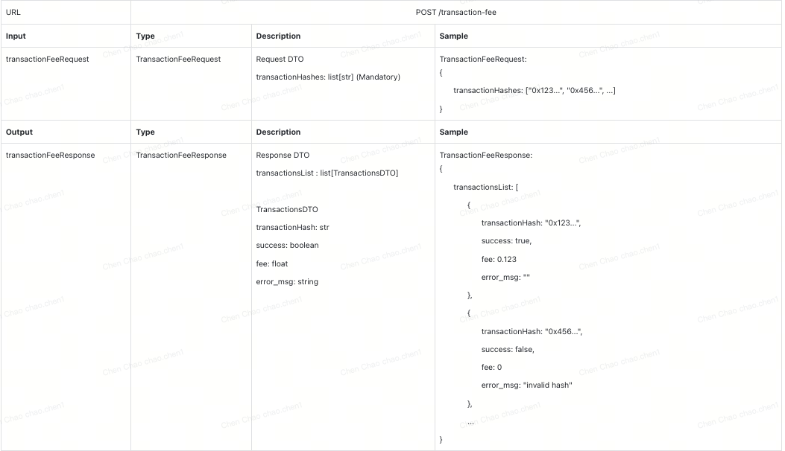

# Uniswap Transaction Tracking System

This system tracks Uniswap V3 USDC/ETH transactions in real-time and supports historical batch data retrieval. It calculates the transaction fee in USDT based on Ethereum gas fees and the ETH/USDT exchange rate at the time of transaction confirmation.



---

## Requirements
1. Docker
2. Docker Compose

### 1. Running the application

To set up the project and its dependencies:

**1. Clone the repository:**
   ```bash
   git clone https://github.com/ChenChao19/TokkaLabs.git
   cd TokkaLabs
   ```
**2. Replace .env file with custom Infura RPC and Etherscan API Key.**

I have provided the free keys for testing purposes.

**3. Build and run the application with docker compose**
   ```bash
   docker compose up --build
   ```
   This would spawn a redis instance and 2 processes, one which is a REST API instance, and another scheduler job instance that loads data periodically.

**4. Accessing the application**

   The application will be available at http://localhost:8000

   The Swagger Doc is available as http://localhost:8000/docs

# Testing

Testing will be done locally using pytest framework.
To run tests and generate a coverage report, follow these steps:

### 1. Set up a Python Virtual Environment
Ensure you have Python >= 3.9 installed. Then, create a virtual environment:

  ```bash
  pip3 install virtualenv
  python3 -m virtualenv venv
  ```
    
### 2. Activate the Virtual Environment
For Linux/macOS:
  ```bash
  source venv/bin/activate
  ```
For Windows:
  ```bash
  .\venv\Scripts\activate
  ```

### 3. Install the Required Dependencies
Install all dependencies from the `requirements.txt` file:
  ```bash
  pip install -r requirements.txt
  ```
### 4. Run the Tests with Coverage Reporting
To run all tests in the project and generate a coverage report, run the following command at the root directory:

  ```bash
  pytest
  ```

This command will run all test files starting with `test_` or ending with `_test` in the `tests/` directory.

# Architectural Principles
1. Microservices-Oriented
Separates transaction retrieval, fee calculation, and real-time data processing services, enabling independent deployment and scaling.
2. Event-Driven
Redis Pub/Sub or Kafka manage asynchronous events, allowing real-time transaction and price data updates.
3. Containerization (Docker)
Ensures consistency and portability across environments, supporting seamless scaling, testing, and deployment.
4. Stateless API (FastAPI)
Stateless REST APIs allow scaling with load balancing and container replication.
5. Caching and In-Memory Processing (Redis)
Redis stores frequently accessed data and handles queuing, optimizing performance.

# Design
For Comprehensive design details, refere to static/TL system design.pdf

## API Design



## Design Considerations
1. Scalability
- **Horizontal Scaling of Redis**: Redis is used to store price and transaction data temporarily, making it suitable for quick access. Redis can be scaled horizontally by deploying a Redis cluster, distributing the load across multiple nodes to handle an increased volume of transactions or data requests.
- **Batch Processing for Historical Data**: The system distinguishes between real-time transaction tracking and historical data retrieval. Batch processing jobs for historical data allow efficient handling of large data sets without affecting real-time processing capabilities, ensuring the system can handle both high transaction volumes and large historical queries.
- **WebSocket for Real-Time Data**: The Binance WebSocket is used for fetching real-time ETH/USDT prices, which minimizes the need for repetitive REST API calls and reduces network overhead. This setup enables the system to scale efficiently while maintaining real-time responsiveness. We can extend this idea to the evm clients and etherscan apis
- **Event-Driven Architecture**: Leveraging an event-driven approach (e.g., using Kafka or RabbitMQ) for processing transaction data and price updates would enable asynchronous processing. For example, the Etherscan transaction loader and Binance price loader could publish events when new data is fetched, and downstream services (e.g., a fee calculation service) could consume these events to perform necessary computations without blocking.
2. Availability
- **Docker and Docker Compose**: Using Docker for containerization ensures a consistent runtime environment and simplifies deployment across multiple servers. Docker Compose helps manage service dependencies like Redis and the API server, facilitating fast recovery and replication in case of a failure.
- **API Rate Limiting and Caching**: Given Etherscan and Binance have API rate limits, implementing caching with Redis and rate-limiting logic ensures that the system doesn't exceed limits and can handle request bursts by serving cached responses.
3. Reliability
- **Data Redundancy in Redis and Message Queues**: Redis provides low-latency data storage for transaction data and pricing, and using a message queue for asynchronous task processing ensures that transaction processing requests are not lost even if components go down temporarily.
- **Fallback Logic for Missing Data**: If transaction or price data is missing, the system can queue requests and notify the client to check back later. This approach allows the system to handle failures gracefully without dropping requests, enhancing reliability.
- **Error Handling and Retry Mechanism**: The system should include robust error handling for API interactions, especially with rate limits and connectivity issues. Implementing retry mechanisms and exponential backoff strategies ensures that temporary failures do not lead to permanent data loss or unhandled exceptions.
These design choices allow the system to handle large volumes of data reliably, adapt to demand variations, and maintain high availability for continuous operation.
# Further Enhancements Possibilities
1. Scalability
- **Database Partitioning and Sharding**: If the transaction or price data exceeds Redis’s capacity or the overall storage requirements grow, database partitioning can help. Sharding based on transaction date or type would allow efficient distribution across multiple storage nodes, thus handling larger data volumes while maintaining query performance.
- **Microservices Architecture**: Dividing the system into smaller, focused microservices—such as one for transaction retrieval, another for fee calculation, and another for data transformation—enables independent scaling. Each microservice can then be scaled horizontally as required, allowing the system to handle increased loads without affecting overall performance.
- **Auto-Scaling for API Instances**: Setting up auto-scaling based on traffic allows the REST API to dynamically adjust to fluctuating workloads. During high-demand periods, more instances are deployed; during low-demand times, resources scale down to optimize costs.
2. Availability
- **Load Balancing**: The REST API endpoints can be scaled by deploying multiple instances behind a load balancer, ensuring that if one instance fails, the load balancer can redirect requests to healthy instances, enhancing availability.
- **Failover and Replication in Redis**: Configuring Redis with primary-replica replication ensures that if one instance fails, another replica can immediately take over. Redis Sentinel or Redis Cluster setups can further automate failover management to enhance the service's availability.
3. Reliability
- **Data Persistence and Backups**: While Redis offers quick access to recent data, for long-term reliability, essential data should also be stored in a persistent database (e.g., PostgreSQL, MongoDB). Routine backups of transaction data ensure that historical data is never lost and can be restored if the main storage fails.
- **Monitoring and Alerting**: Implementing robust monitoring and alerting is crucial. Tools like Prometheus and Grafana can track application metrics (e.g., request latency, error rates, memory usage). Automated alerts ensure rapid response to system issues, supporting reliability and proactive troubleshooting.